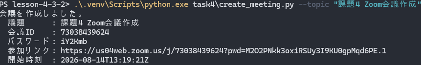
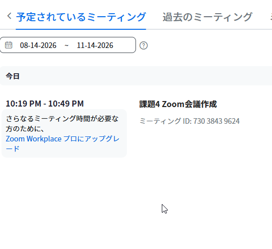
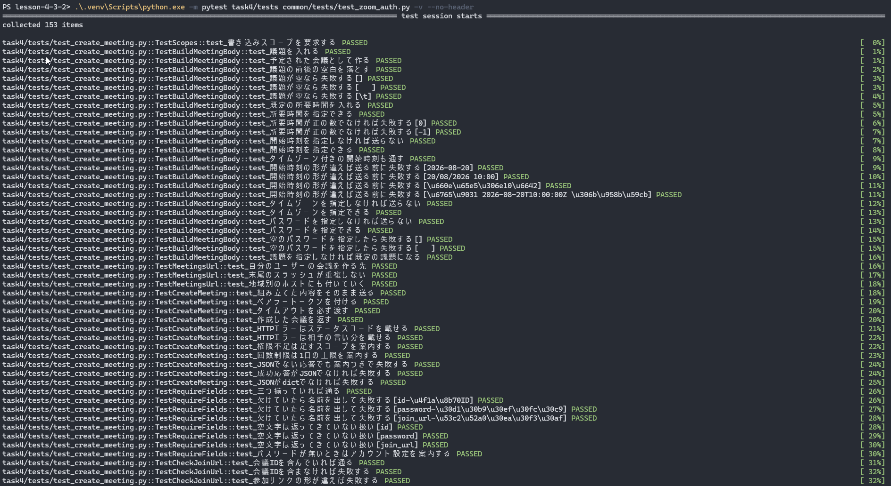
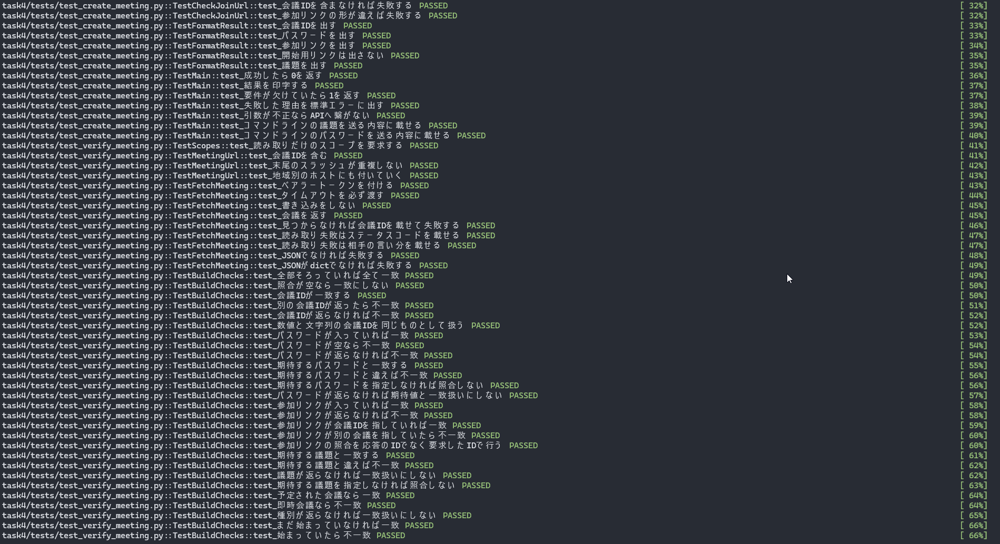
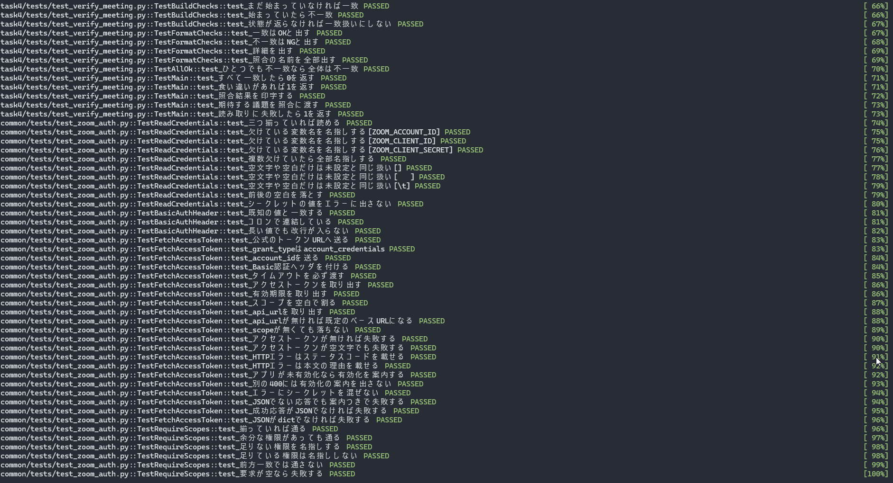
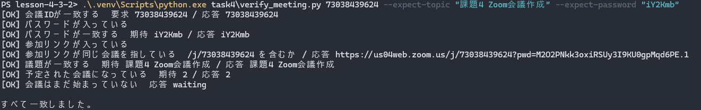
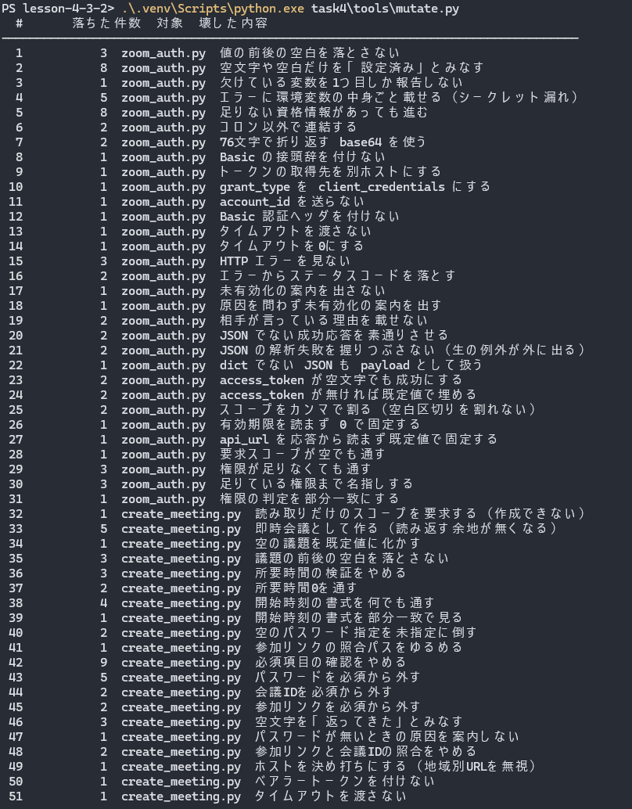
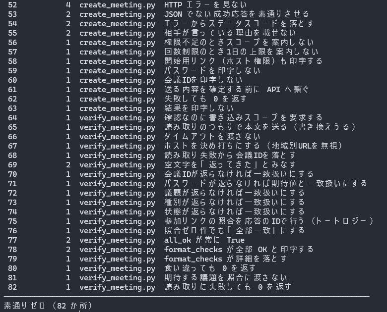

# 課題4: Zoom API

> Zoom API を利用して、会議を作成し、ID・パスワード・会議リンクを作成するコードを
> 作成してください。

Zoom の会議を作り、**会議 ID・パスワード・参加リンク**を表示する。

> **状態（2026-08-14）**: 実装・テスト**153件**・わざと壊すのを**82か所**やって穴ゼロ。
> **実機で作成と読み返し照合まで確認済み**（このページの実行結果はすべて実測値）。
> このページの「調べたこと」「照合する項目」は、**コードを書く前に**確定させた内容。

## 先に調べたこと（コードを書く前に）

課題2で「Docs API が有効になっていない」、課題3で「個人アカウントでは設定できない」に
当たった。どちらもコードの問題ではなく、**コードの外側にある状態**だった。
課題1のフィードバックにも「API からはコード以外の操作などが必要になってきます」とある。

今回は相手が Google ですらない。**認証の形からして違う**ので、そこを先に確定させた。

### Google とは認証の形が違う

| | 課題1〜3（Google） | 課題4（Zoom） |
|---|---|---|
| 方式 | OAuth 2.0（三者間） | **Server-to-Server OAuth**（二者間） |
| 同意画面 | ブラウザが開く | **開かない** |
| 資格情報 | `credentials.json`（ダウンロード） | Account ID / Client ID / Client Secret（3つの文字列） |
| トークンの保存 | `token.json` に保存して再利用 | **保存しない**（毎回取り直す） |
| リフレッシュ | リフレッシュトークンで延長 | **リフレッシュトークンが無い** |
| 有効期限 | 延長できる | 1時間（3600秒） |

`token.json` に相当するものが無い。**毎回 client_id / client_secret からトークンを
取り直す**のがこの方式の正しい姿で、保存する場所を用意しないほうが素直になる。

### 使う API

| 項目 | 値 |
|---|---|
| トークン取得 | `POST https://zoom.us/oauth/token`（`grant_type=account_credentials`） |
| 会議の作成 | `POST {api_url}/v2/users/me/meetings` |
| 会議の読み取り | `GET {api_url}/v2/meetings/{meetingId}` |
| 認証ヘッダ | トークン取得は `Basic base64(client_id:client_secret)`、API 呼び出しは `Bearer {token}` |

**`api_url` を決め打ちにしない。** トークンの応答に `api_url` が入っていて、
地域ごとに違うホストが返る。実測では `us04web.zoom.us` の会議が
`api.zoom.us` から作られた。応答の値をそのまま使う。

### スコープ

Server-to-Server OAuth は**アカウントレベル**のアプリなので、`:admin` が付く。

| スクリプト | 要求するスコープ | 理由 |
|---|---|---|
| `task4\create_meeting.py` | `meeting:write:meeting:admin` | 会議を作る |
| `task4\verify_meeting.py` | `meeting:read:meeting:admin` | 読み返すだけ。書き込みは要求しない |

課題1で `drive.file` を選んだのと同じで、いちばん狭いものを取る。
**確認のためのスクリプトに書き込み権限を持たせない。**

granular scope の書式は `リソース:操作:対象:レベル`。`meeting:read:meeting` と
`meeting:read:meeting:admin` は**前方一致しているが別物**なので、権限の判定は
完全一致で行う（部分一致で通すと「足りている」と報告してから 401 になる）。

### レート制限

無料プランの表とは**別枠**で、会議の作成・更新に上限がある。

| 種別 | 上限 |
|---|---|
| Light API | 4/秒・6,000/日 |
| Medium API | 2/秒・2,000/日 |
| Heavy API | 1/秒・1,000/日 |
| **会議の作成/更新** | **1ユーザーあたり1日100回**（UTC 基準でリセット） |

429 が返ったときに「待てば直るのか、設定が悪いのか」が分からないと困るので、
**429 のときだけ1日の上限を案内に出す**ようにした。

### 返ってくる形

| フィールド | 中身 |
|---|---|
| `id` | 会議 ID。**数値**で返る |
| `password` | 参加パスワード。**アカウント設定によっては返らない**（下記） |
| `join_url` | 参加リンク。`https://{host}/j/{id}?pwd=...` |
| `start_url` | **ホストとして開始するリンク**。`zak=` にホスト権限のトークンが入る |
| `type` | `2` = 予定された会議 |
| `status` | 作成直後は `waiting` |

課題が言う「ID・パスワード・会議リンク」は `id` / `password` / `join_url` の3つ。

**`start_url` は画面に出さない。** ホスト権限のトークンが入っているので、
実行画面のスクリーンショットを公開リポジトリに置くと、**他人がホストとして
会議を乗っ取れる**。「出さないこと」をテストで固定してある。

### 着手前に確かめられなかったこと（実機で解決した）

**パスワードが自動生成されるかは、アカウント設定に依存する。**
公式の案内には「セキュリティオプションが必須の設定なら Zoom が有効なパスワードを
生成して応答に含める」とある一方、待機室や認証が有効な場合は生成されないこともある、
とも書かれていた。**こちらの無料アカウントでどちらになるかは、叩くまで分からない。**

**結果（2026-08-14 実測）: 指定しなくても生成された**（`iY2Kmb`）。

生成されなかった場合に備えて、`--password` で明示指定できるようにしてある。
そして**パスワードが返ってこなかったときは成功にしない**。既定値で埋めると
「作れたつもり」になり、要件を満たしていないことに気づけなくなる。

## 照合する項目（実物を見る前に決めた）

課題1は MD5（中身のバイト列）、課題2は段落数（文書の構造）、
課題3は参加リンクと会議コードの関係で照合した。
**相手の形が変われば、確かめたことになる項目も変わる。**

Zoom の会議にも、返ってくる値の**あいだに規則がある**。

> `join_url`: ホストのあとに `/j/` と `id` が続く

`id` と `join_url` は別々のフィールドとして返ってくるのに、片方からもう片方の
一部が決まる。ここを軸にする。

| # | 照合する項目 | 見ているもの |
|---|---|---|
| 1 | 会議 ID が一致 | 読み返したのが本当にその会議か |
| 2 | パスワードが入っている | 要件そのもの。空でないこと |
| 3 | パスワードが一致 | 作成時に返った値と、読み返した値が同じか |
| 4 | 参加リンクが入っている | 要件そのもの |
| 5 | 参加リンクが同じ会議を指している | `join_url` が `/j/{id}` を含むか |
| 6 | 議題が一致 | 送った `topic` が反映されたか |
| 7 | 予定された会議になっている | `type` が `2`。即時会議になっていないこと |
| 8 | 会議はまだ始まっていない | `status` が `waiting`。**作成と開催は別** |

**5番が今回の要。** 1番と3番は「同じ値が返ってきた」しか言っていない。
サーバが両方おかしな値を返せば、どちらも一致する。5番だけが、2つの値のあいだの
規則を見ている。

そして**5番の物差しには、応答の `id` ではなく、こちらが要求した会議 ID を使う。**
応答どうしで比べると、`id` と `join_url` が揃って間違っている場合に
トートロジーになって通ってしまう。

**8番は「作成 ≠ 開催」を確かめる項目。** リンクができたことと、会議が
始まっていることは違う。ここを混ぜると「作れた」の意味が曖昧になる。

値が返ってこなかった項目は NG にする（課題1〜3と同じ）。
既定値を入れると、照合できなかったケースが全部「一致」に化ける。

## 認証は共有した。ただし Google とは別モジュールにした

課題3で `common/google_auth.py` を作った。今回は `common/zoom_auth.py` を
**その隣に並べた**。共通の抽象は被せていない。

上の表のとおり、Google は「同意画面 → 保存 → リフレッシュ」、Zoom は「毎回取り直し」で、
まとめると**どちらの説明も嘘になる**。`common/` がベンダー名でファイルを分ける形に
なっていたので、並べるだけで済んだ。

```python
from common import zoom_auth

SCOPES = ("meeting:write:meeting:admin",)
credentials = zoom_auth.read_credentials(os.environ)
token = zoom_auth.fetch_access_token(credentials)
zoom_auth.require_scopes(token, SCOPES)
```

**スコープの既定値は持たせていない**（`common/google_auth.py` と同じ約束）。
課題ごとに違う値で、間違えても「権限が足りないまま動いているように見える」形になる。

`require_scopes` は Google 側の `has_scopes` に相当する。トークンの応答に
`scope` が入っているので、**API を叩く前に権限不足を検出できる**。

共有モジュールなので、**切り出しと同時に専用のテストを書いた**
（`common/tests/test_zoom_auth.py`）。共有物にテストが無いと、壊れたときに落ちるのは
「使っている側の課題」で、原因が共有物にあると分かりにくい。

## セットアップ（Zoom 側の手作業）

コードの前に、Zoom App Marketplace での作業が要る。**ここで2回詰まった**
（「つまずいたところ」参照）。

1. https://marketplace.zoom.us/ にサインイン
2. **Develop → Build App → Server-to-Server OAuth** を選んで Create
3. **Basic Information** に説明・会社名・開発者の連絡先を入力
4. **Scopes → + Add Scopes** で、チェックを入れて追加する
   - `meeting:write:meeting:admin`
   - `meeting:read:meeting:admin`
5. **Scopes タブに2つ並んで表示されていることを確認する**
6. **Activation → Activate your app**
7. **App Credentials** の Account ID / Client ID / Client Secret を控える

資格情報は環境変数で渡す。ファイルには置かない。

```powershell
$env:ZOOM_ACCOUNT_ID="<Account ID>"
$env:ZOOM_CLIENT_ID="<Client ID>"
$env:ZOOM_CLIENT_SECRET="<Client Secret>"
```

3つのうち1つでも欠けていたら、**欠けている変数名を全部名指しして**落ちる。
1つ直しては再実行、を繰り返させないため。空文字（`ZOOM_CLIENT_SECRET=` とだけ
書いた状態）も「未設定」と同じ扱いにする。存在の有無だけを見ると素通りして、
Zoom から 400 が返るまで気づけない。

**エラーにシークレットの値そのものは載せない。** 実行画面のスクリーンショットを
公開リポジトリに置くため。

## 実行方法

**すべてリポジトリのルート（`lesson-4-3-2/`）で実行する。**

```bash
.venv\Scripts\python.exe task4\create_meeting.py --topic "課題4 Zoom会議作成"
```

実測（2026-08-14）:

```
会議を作成しました。
  議題      : 課題4 Zoom会議作成
  会議ID    : 73038439624
  パスワード: iY2Kmb
  参加リンク: https://us04web.zoom.us/j/73038439624?pwd=M2O2PNkk3oxiRSUy3I9KU0gpMqd6PE.1
  開始時刻  : 2026-08-14T13:19:21Z
```



**パスワードは指定していない。** ここに出ている `iY2Kmb` は Zoom が生成した値。

**開始時刻も指定していない。** `--start-time` を渡していないのに返ってきた
（作成した時刻）。返ってきたときだけ表示する作りにしてある。

会議 ID・パスワードは実行ごとに変わる。**このページに出てくる値は全部この1回の
実行のもの**で、下の照合結果も同じ会議を指している。

Zoom 側にも会議ができている。



**この画面は、API の応答と別々の経路から出てきた値なので、突き合わせに使える。**

| API が返した値 | Zoom の画面 | 噛み合っているか |
|---|---|---|
| `id` = 73038439624 | ミーティング ID: 730 3843 9624 | 区切りを除けば同じ |
| `start_time` = `2026-08-14T13:19:21Z`（UTC） | 10:19 PM（JST） | 13:19Z + 9時間 = 22:19 JST |
| `duration` = 30（既定値） | 10:19 PM - 10:49 PM | 30分 |
| `type` = 2（予定された会議） | 「予定されているミーティング」に表示 | 即時会議ではない |

`verify_meeting.py` の照合は API 同士の突き合わせなので、**Zoom が API にだけ
辻褄の合う値を返していれば通ってしまう**。画面は別の経路なので、そこが揃うことは
別の証拠になる。

### オプション

| オプション | 意味 |
|---|---|
| `--topic` | 会議の議題（既定: `AIエンジニア講座 課題4 テスト会議`） |
| `--start-time` | 開始時刻（例: `2026-08-20T10:00:00Z`）。書式が違えば**送る前に**落とす |
| `--duration` | 所要時間（分、既定 30）。1以上の整数のみ |
| `--timezone` | タイムゾーン（例: `Asia/Tokyo`） |
| `--password` | 参加パスワード。**未指定なら Zoom 側で生成される** |
| `--agenda` | 会議の説明 |

**「省略した」と「空を指定した」を区別する。** `--topic ""` は打ち間違いなので
落とす。省略（未指定）だけが既定値になる。`--password ""` も同じ。
`or` でまとめると、指定したつもりの値が黙って既定に化ける。

## テスト

```bash
.venv\Scripts\python.exe -m pytest task4\tests common\tests\test_zoom_auth.py -v --no-header
```

**153件**（リポジトリ全体では**480件**）。分類は3つ。

| 層 | 見ているもの |
|---|---|
| 送る前 | 議題・所要時間・開始時刻の検証、リクエストの組み立て、環境変数の読み取り |
| API の呼び方 | 偽の `post` / `get` を渡し、URL・ヘッダ・本文・タイムアウトに何を渡したかを記録して照合する |
| 画面と終了コード | `main` が結果を**印字する**こと、失敗時に 1 を返すこと |





本物の Zoom には繋がない。`verify_meeting.py` のテストでは、
**`json` も `data` も渡していないこと**を確かめている。確認のつもりの実行が
状態を変えてしまうと、やり直しがきかなくなるため。

## テストで閉じない穴は、実物を1回読んで閉じる

偽の `post` で固定できるのは**呼び方まで**。次の4つは、153件が全部通っても分からない。

1. 無料アカウントで会議を作れるか
2. パスワードが自動生成されるか
3. `type` と `status` が本当に `2` / `waiting` で返るか
4. `join_url` が本当に `/j/{id}` を含む形か

そこで `verify_meeting.py` を作った。作った会議を **Zoom API から読み返して、
作成時に返った値と突き合わせる**。読むだけで何も変更しない。

```bash
.venv\Scripts\python.exe task4\verify_meeting.py 73038439624 --expect-topic "課題4 Zoom会議作成" --expect-password "iY2Kmb"
```

実測（2026-08-14・上の実行で作った会議）:

```
[OK] 会議IDが一致する  要求 73038439624 / 応答 73038439624
[OK] パスワードが入っている
[OK] パスワードが一致する  期待 iY2Kmb / 応答 iY2Kmb
[OK] 参加リンクが入っている
[OK] 参加リンクが同じ会議を指している  /j/73038439624 を含むか / 応答 https://us04web.zoom.us/j/73038439624?pwd=M2O2PNkk3oxiRSUy3I9KU0gpMqd6PE.1
[OK] 議題が一致する  期待 課題4 Zoom会議作成 / 応答 課題4 Zoom会議作成
[OK] 予定された会議になっている  期待 2 / 応答 2
[OK] 会議はまだ始まっていない  応答 waiting

すべて一致しました。
```



終了コード 0。**上の4つが、ここで初めて言えるようになった。**
1 は通ったこと自体が答え。2 は生成された。3 は実測どおり。
4 は「同じ会議を指している」で見た。

## つまずいたところ

### アプリを有効化しないと、トークンが取れない

スコープを追加したのに、最初の実行がこれで落ちた。

```
Zoom のトークン取得に失敗しました（HTTP 400）: The app has been disabled by the developer
```

**Zoom は英語で「無効になっている」としか言わない。** どこで何を押せば直るのかは
書いていない。公式ドキュメントには「アプリが有効化されていないとアクセストークンを
生成できない」と明記があった。

さらに、**スコープを追加すると有効化が外れる**。一度 Activate しても、
権限を足すたびに Activate し直す必要がある。

原因が分かった時点で、**その分岐でしか出せない情報**を案内に足した。

```
Zoom のトークン取得に失敗しました（HTTP 400）: The app has been disabled by the developer
Zoom App Marketplace のアプリが有効化されていません。アプリの Activation で Activate してください。
スコープを追加したあとは有効化が外れるので、追加のたびに Activate し直す必要があります。
```

**原因が違うときは足さない。** 同じ案内を全部の 400 に出すと、合っている設定を
疑わせて遠回りさせる。「別の 400 には出さない」ほうもテストで固定した。
課題3で「Google が項目名まで教えてくれているのに、こちらが候補を3つ並べて埋めていた」
という失敗をしたので、その逆をやっている。

### スコープは「見えている」だけでは、追加されていない

Activate を押したら今度はこれが出た。

```
Select at least one scopes
```

**Add Scopes の検索結果に出ていることと、アプリに追加されていることは別だった。**
一覧に表示されているのを見て「使える」と判断していたが、チェックボックスに
チェックを入れて確定していなかった。

前の失敗（`The app has been disabled by the developer`）と同じ話の裏表で、
**スコープ0件 → 有効化できない → トークンが取れない**、で繋がっていた。
先に出たエラーだけを見ていると、原因が2つ手前にあることに気づけない。

### 検証ツールが、実装を壊したまま止まった

`mutate.py` の実行を途中で止めたあと、`pytest` が1件だけ落ちた。
調べたら `verify_meeting.py` に `if False:` が残っていた。

```python
    if False:                      # 本来は if not all_ok(checks):
        print("\n食い違いがあります。", file=sys.stderr)
        return 1
```

`mutate.py` は `atexit` で後始末をする作りだった。**`atexit` は強制終了では走らない。**

さらに悪いことに、docstring に書いてあった復旧手順が**実際には動かなかった**。

```
強制終了で壊れたまま残ったときは次で戻せる:
    git checkout -- common/zoom_auth.py
```

`git checkout` は**未コミットの新規ファイルには効かない**。追跡されていないので
復元対象にならない。課題3から持ち込んだ文章を、対象ファイルが git 管理下にある
前提のまま使っていた。

開始時に控えをディスクへ書き、**次回の起動時に必ず突き合わせて戻す**形に変えた。
復旧を「人が思い出して打つコマンド」ではなく、道具側の責任にした。

```
! 前回の中断で verify_meeting.py が壊れたまま残っていたので元に戻した
```

**壊して確かめる道具は、壊れたまま止まる。** 課題3で「確かめる操作そのものが
成果物を上書きする」に当たったのと同じ形が、今度は検証ツール側で出た。

### テストが、自分の実装のバグを2つ捕まえた

どちらも書いた直後に落ちた。

**1つめ。** `--topic ""` が黙って既定の議題に化けていた。

```python
topic = (topic or DEFAULT_TOPIC).strip()   # "" も None も既定値になる
```

`--password` では「省略」と「空を指定」を区別していたのに、`--topic` では
`or` でまとめて崩していた。同じ判断を2か所でして、片方だけ間違えていた。

**2つめ。** 開始時刻の正規表現に `^` と `$` を書いたまま `fullmatch` を使っていた。
アンカーが二重なので、`search` に変えても挙動が変わらない。
つまり**「全体一致で見ている」ことをテストで固定できていなかった**。
`^` と `$` を外して、`来週 2026-08-20T10:00:00Z に開始` のような
「正しい書式が混ざっているだけ」の値をテストに足した。

## わざと壊して確かめた（**82か所**・素通りゼロ）

書いた直後にやった。課題3のスクリプトを持ち込み、対象を
`common/zoom_auth.py` と task4 の2本に差し替えた。

```bash
.venv\Scripts\python.exe task4\tools\mutate.py
```

通っているテストの数は、守られている範囲を意味しない。
落ちなかった行が「テストが見ていない場所」なので、そこだけ手当てする。




### 最初は3か所が素通りした

| 素通りしたもの | 何が起きていたか |
|---|---|
| `api_url` を応答から読まず既定値で固定する | **テストデータが既定値と同じ値だった**。応答を読まなくても一致する。地域別のホスト（`eu01api-www4local.zoom.us`）に変えて、既定値と違う値で見るようにした |
| 会議 ID を印字しない | 出力全体を `in` で見ていたので、**参加リンクの中に会議 ID が入っている**ぶん、会議 ID の行を消しても通っていた。行を特定して見るようにした |
| 状態が返らなければ一致扱いにする | `status` が「返ってこない」ケースのテストが無かった。足りない側のテストを足した |

3つとも**テストの側を締めて消した**（実装は変えていない）。
1つめと2つめは同じ形で、**テストデータが1種類だと、たまたま一致しているものを
検出できない**という話だった。

## 文章もコードと突き合わせた

README に書いた数字や名前は、書いた時点では正しくても、あとから増減する。

```bash
.venv\Scripts\python.exe task4\tools\check_docs.py
```

| 検査 | 見ているもの |
|---|---|
| 会議 ID が1種類だけ | 実行画面と照合画面が**別の会議を指したまま**並んでいないか |
| スコープ名がコードと一致 | `meeting:write:meeting:admin` と書くべき所が別の表記になっていないか |
| 「〜件」の数字が実測と一致 | pytest に数えさせた値と突き合わせる |
| 参照しているファイルが実在する | 名前を変えたときに文章が置き去りになっていないか |

この検査を作った直後、**このページに書こうとしていたテスト件数が既に古かった**
（151件と書いていたが、実際には153件だった）。目視では見つからない種類のズレ。

## 後始末

この会議は提出のために作ったもので、**Zoom API から削除できる**
（`DELETE /meetings/{meetingId}`）。課題3の Meet はスペースを削除する API が
無く、作りっぱなしにするしかなかったので、そこは Zoom のほうが素直だった。

削除には別のスコープを追加する必要がある。**このリポジトリでは実装していない**
（採点が済むまで会議を残すため）。
