# 課題5: Gmail API

> Gmail API を使用して、特定の宛先にメールを送信するプログラムを作成してください。

Gmail からメールを1通送り、**送ったものを読み返して突き合わせる**。

> **状態（2026-08-15）**: 実装・テスト**176件**・わざと壊すのを**121か所**やって穴ゼロ。
> **実機で送信と読み返し照合まで確認済み**（このページの実行結果はすべて実測値）。
> このページの「調べたこと」「照合する項目」は、**コードを書く前に**確定させた内容。

## この課題だけ、前提がひとつ違う

課題1〜4は、間違えたら消してやり直せた。Drive のファイルも、Docs も、Meet の
スペースも、Zoom の会議も。**メールは取り消せない。** 相手の受信箱に残るし、
Gmail API に「送信を取り消す」操作は無い。

そこで、確認を最初から2つに割った。

| | 確かめられること | やり直し |
|---|---|---|
| **送る前** | 宛先・件名・本文・MIME の組み立て・base64url 化 | 何度でも |
| **送った後** | サーバに実際に載った値 | 1回きり |

`--dry-run` が前半で、`task5/verify_mail.py` が後半にあたる。

**`--dry-run` は service を作らない。** service を作る＝OAuth の同意画面が
開きうるということなので、送らないと決まっている実行で本人のブラウザを触らない。
課題3で「落ちると分かっている実行で同意画面を出さない」をやったが、今回は
「**送らないと分かっている実行**で同意画面を出さない」に伸ばしている。

## 先に調べたこと（コードを書く前に）

### 使う API

| 項目 | 値 |
|---|---|
| 送信 | `POST users.messages.send`（`userId=me`） |
| 読み取り | `GET users.messages.get`（`userId=me`, `format=full`） |
| 送るもの | `{"raw": "<RFC 2822 のメッセージを base64url にした文字列>"}` |

`raw` は **base64url**（`+` `/` ではなく `-` `_`）と定められている。
標準の base64 をそのまま使うと、`+` と `/` が別の意味に取られうる。

読み取りの `format` は4種類（`minimal` / `full` / `raw` / `metadata`）。
**`metadata` では本文が返らない**（ヘッダとラベルだけ）ので `full` を使う。

### スコープ — 「送る」と「読み返す」で別物だった

課題1〜4では、ひとつの課題で読み書き両方のスコープを1本の `token.json` に
入れていた。Gmail は事情が違う。

`users.messages.send` を受け付けるスコープは4つある。

| スコープ | 意味 |
|---|---|
| `https://www.googleapis.com/auth/gmail.send` | 送信のみ |
| `https://www.googleapis.com/auth/gmail.compose` | 下書きの管理と送信 |
| `https://www.googleapis.com/auth/gmail.modify` | 読み・作成・送信 |
| `https://mail.google.com/` | 読み・作成・送信・完全削除 |

いちばん狭い `https://www.googleapis.com/auth/gmail.send` を採った。
**そしてこれだけでは `users.messages.get` が通らない。** 送信専用なので、
受信箱は読めない。

読み返す側の候補は2つ。

| スコープ | 読めるもの |
|---|---|
| `https://www.googleapis.com/auth/gmail.metadata` | ヘッダとラベルのみ。**本文は読めない** |
| `https://www.googleapis.com/auth/gmail.readonly` | 本文を含む全部 |

**`https://www.googleapis.com/auth/gmail.readonly` を採った。** `metadata` のほうが
権限は狭いが、それだと「送った本文が正しく載ったか」を永久に確認できない。
確認できない項目を残すくらいなら、権限を1段広げて確かめるほうを選んだ。
（この判断は狭いほうが常に正しいわけではない、という例になっている。）

| スクリプト | 要求するスコープ |
|---|---|
| `task5/send_mail.py` | `https://www.googleapis.com/auth/gmail.send` |
| `task5/verify_mail.py` | `https://www.googleapis.com/auth/gmail.readonly` |

**確認するだけのスクリプトに送信権限を持たせない**（課題4と同じ約束）。

### トークンのファイルを2本に分けた

`common/google_auth.py` は、**要求したスコープを満たさないトークンを捨てて
取り直す**作りになっている。ここに上の2つを組み合わせると問題が出る。

1本のファイルを共有すると、`send`（`gmail.send` で保存）→ `verify`
（`readonly` が足りないので取り直し、`gmail.send` が消える）→ `send`
（今度は `gmail.send` が足りないので取り直し）…… と、**実行のたびに
同意画面が出続ける**。

```
task5/token-send.json     ← gmail.send
task5/token-verify.json   ← gmail.readonly
```

分ければ最初の1回ずつで済む。課題3から持ち越していた「課題ごとに token を
分けるか」という宿題は、**課題ごとどころか、同じ課題の中でも権限が違えば
分ける必要がある**という形で決着した。

どちらも `.gitignore` の `token*.json` に入る。実証:

```bash
git check-ignore -v task5/token-send.json task5/token-verify.json
```

```
.gitignore:13:token*.json	task5/token-send.json
.gitignore:13:token*.json	task5/token-verify.json
```

### RFC 2822 を満たす組み合わせは1つしかなかった

Python の `email.message.EmailMessage` でメッセージを組む。ここで既定のまま
使うと、**RFC 2822 の要求を2つとも満たさない**。行末は CRLF、本文は 7bit と
定められているのに、既定では LF・8bit になる。

実測（2026-08-15）:

| 組み合わせ | 行末が CRLF | 7bit に収まる |
|---|---|---|
| 既定 policy・既定 cte | ✗ | ✗ |
| 既定 policy・`cte="base64"` | ✗ | ✓ |
| `policy.SMTP`・既定 cte | ✓ | ✗ |
| **`policy.SMTP` + `cte="base64"`** | **✓** | **✓** |

両方指定して初めて条件を満たす。片方だけでは足りない。

### 送った文字列は、そのままの形では返ってこない

照合を設計するうえで、これがいちばん効いた。**送った文字列と読み返した文字列は、
素朴に比べると必ず食い違う。** 理由が2つある。

**1. 日本語の件名は RFC 2047 で符号化される。**

```
Subject: Gmail API =?utf-8?b?44GL44KJ44Gu6YCB5L+h44OG44K544OI?=
```

ASCII の部分は素のまま、日本語だけが符号化される。解かずに比べると永久に一致しない。
復号には3通りの書き方があるが、**この形では3通りとも同じ結果になる**ことを実測で
確かめたうえで、いちばん単純な `decode_header` + 連結を採った（符号化語の直前の
空白は ASCII 側のチャンクに残るので、連結で消えない）。

**2. 本文の行末が CRLF になる。**

`policy.SMTP` はヘッダだけでなく本文の行末も CRLF に直す。LF で書いた本文が、
サーバ上では CRLF になっている。**正規化しないと、複数行の本文は内容が
合っていても必ず NG になる。**

正規化は**期待値と実際の両方**に掛ける。片側だけだと、CRLF で書かれた本文を
渡したときに落ちる。

### ヘッダインジェクション

送信 API に固有で、課題1〜4には無かった観点。宛先や件名に改行を混ぜられると、
**改行から先が別のヘッダとして解釈される。**

```
--to "<自分のメールアドレス>
Bcc: attacker@example.com"
```

これが通ると、見えない宛先にコピーが飛ぶ。**送信は取り消せない**ので、
ネットワークに出る前に落とす。`To` / `Subject` / `From` の3つで検査している。

## 照合する項目（実物を見る前に決めた）

課題1は MD5（バイト列）、課題2は段落数（構造）、課題3は参加リンクと会議コードの
関係、課題4は `join_url` と `id` の関係で照合した。**相手が変われば、確かめた
ことになる項目も変わる。**

| # | 照合する項目 | 見ているもの |
|---|---|---|
| 1 | メッセージ ID が一致 | 読み返したのが本当にそのメールか |
| 2 | 送信済みラベルが付いている | **下書きで終わっていないこと**（`SENT`。下書きなら `DRAFT`） |
| 3 | 宛先が一致 | 要件そのもの。「特定の宛先に」送れたか |
| 4 | 件名が一致 | RFC 2047 を解いた上で |
| 5 | 本文が一致 | 行末を揃えた上で |
| 6 | 送信元が入っている | 指定していない `From` を Gmail が埋めたか |
| 7 | スレッド ID が返っている | メールとして成立しているか |

**2番が今回の要。** 「API がエラーを返さなかった」と「送信済みになった」は
別のことで、下書きとして保存されていても前者は成立する。ラベルだけが
そこを見分ける。課題4の「作成 ≠ 開催」と同じ形の区別。

**期待値はすべてコマンドラインから渡させる。** 応答の値どうしを比べると、
サーバがおかしな値を返したときにトートロジーで通る（課題4の教訓）。
`--to` を必須引数にしてあるのはそのため。

値が返ってこなかった項目は NG にする。既定値で埋めると、照合できなかった
ケースが全部「一致」に化ける。

## セットアップ（Google 側の手作業）

Google Cloud コンソールの「APIとサービス」→「ライブラリ」で **Gmail API** を
有効にする。課題1は Drive API、課題2は Docs API、課題3は Meet API で、
**どれも別の API**。毎回この1工程が要る。

同意画面は**2回**出る（送信用と読み取り用で別のトークンを取るため）。
権限の文言もそれぞれ違う。

## 実行方法

**すべてリポジトリのルート（`lesson-4-3-2/`）で実行する。**

> **宛先は `<自分のメールアドレス>` に伏せてある。** 実際に送ったのは自分から自分への
> 1通で、それ以外は加工していない。public リポジトリに実在するアドレスを置くと
> 収集されるため、**コマンド・実行結果・スクリーンショットのすべてで伏せている。**
> テストの中で使っているのは RFC 2606 が予約している `example.com` のアドレスで、
> こちらは実在しない。

### 1. 送らずに組み立てだけ見る

**この段階は実在しないアドレスで試せる。** `example.com` は RFC 2606 の予約ドメインで
永久に届かないが、`--dry-run` はネットワークに出ないので関係ない。

```bash
.venv\Scripts\python.exe task5\send_mail.py --to you@example.com --dry-run
```

実測（2026-08-15）:

```
--- 組み立てた内容（まだ送信していません）---
  宛先: you@example.com
  件名: Gmail API からの送信テスト
  本文:
    こんにちは。
    これは Gmail API から送信したメールです。

    AIエンジニア講座 Section 4-3 課題5

送信するには --dry-run を外して実行してください。
```

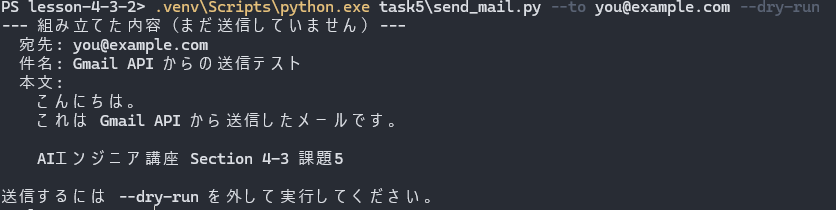

**この実行では認証もネットワーク通信も起きていない。** Gmail API を
有効化する前でも通る。

宛先が壊れていれば、ここで落ちる。宛先に改行を混ぜてみる
（PowerShell では `` ` `` がエスケープ文字なので、`` `n `` が改行になる）。

```powershell
.venv\Scripts\python.exe task5\send_mail.py --to "you@example.com`nBcc: attacker@example.com"
```

実測（2026-08-15）:

```
宛先に改行が含まれています。
改行から先は別のヘッダとして解釈されるため、意図しない宛先が足される恐れがあります（ヘッダインジェクション）。
```

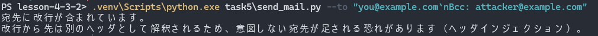

終了コード 1。**`--dry-run` すら付けていないのに、ネットワークには出ていない。**
送る内容を確定させてから service を作る順序にしてあるので、宛先が壊れた実行は
認証まで到達しない。

### 2. 送る

```bash
.venv\Scripts\python.exe task5\send_mail.py --to <自分のメールアドレス>
```

実測（2026-08-15）:

```
メールを送信しました
  宛先          : <自分のメールアドレス>
  件名          : Gmail API からの送信テスト
  メッセージID  : 1a005a0faaf4bb45
  スレッドID    : 1a005a0faaf4bb45

送信できたことと、正しい形でサーバに載ったことは別です。読み返して照合するには:
  .venv\Scripts\python.exe task5\verify_mail.py --message-id 1a005a0faaf4bb45
```

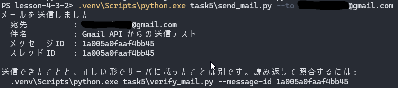

メッセージ ID は送るたびに変わる。**このページに出てくる ID はすべてこの1回の
送信のもの**で、下の照合結果も同じメールを指している。

受信箱にも届いている。

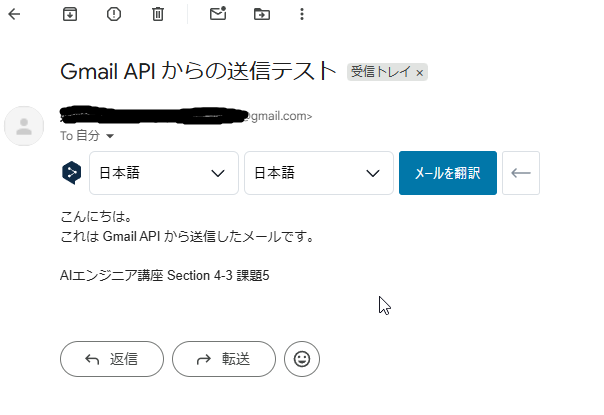

**この画面は API の応答とは別の経路なので、突き合わせに使える。**
`verify_mail.py` の照合は API 同士なので、Gmail が API にだけ辻褄の合う値を
返していれば通ってしまう。画面が揃うことは別の証拠になる。

### 3. 読み返して照合する

```bash
.venv\Scripts\python.exe task5\verify_mail.py --message-id 1a005a0faaf4bb45 --to <自分のメールアドレス>
```

実測（2026-08-15・上の送信で作ったメール）:

```
読み返した内容と、指定した内容の照合:
  [OK] メッセージID
  [OK] 送信済みラベル
  [OK] 宛先
  [OK] 件名
  [OK] 本文
  [OK] 送信元
  [OK] スレッドID

すべて一致しました。
```

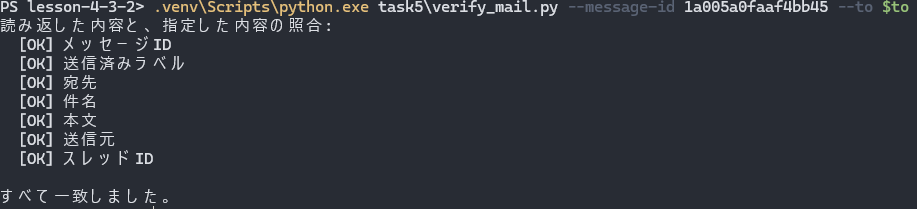

終了コード 0。**件名の RFC 2047 と本文の CRLF を解いた上で一致している**ことが、
ここで初めて言えるようになった。

### オプション

| オプション | 意味 |
|---|---|
| `--to` | 宛先。**必須**。改行・空白・`@` の数を送る前に検査する |
| `--subject` | 件名（既定: `Gmail API からの送信テスト`） |
| `--body` | 本文（`--body-file` と排他） |
| `--body-file` | 本文を読むファイル（UTF-8） |
| `--dry-run` | 組み立てて表示するだけ。**送らないし、認証もしない** |
| `--token` | トークンの保存先（既定: `task5/token-send.json`） |

**「省略した」と「空を指定した」を区別する**（課題4と同じ）。`--subject ""` は
打ち間違いなので落とす。省略だけが既定値になる。本文だけは扱いが違い、
**前後の改行を落とさない**——件名と違って本文の空行は意味を持つ。

## テスト

```bash
.venv\Scripts\python.exe -m pytest task5\tests -v --no-header
```

**176件**（リポジトリ全体では**656件**）。分類は3つ。

| 層 | 見ているもの |
|---|---|
| 送る前 | 宛先・件名・本文の検証、MIME の組み立て、base64url、RFC 2822 の要求 |
| API の呼び方 | 偽の service を渡し、`userId` / `id` / `format` / `body` に何を渡したかを記録して照合する |
| 画面と終了コード | `main` が結果を**印字する**こと、失敗時に 1 を返すこと |

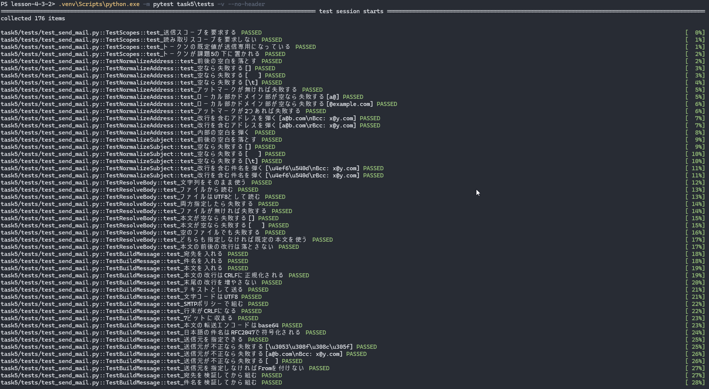
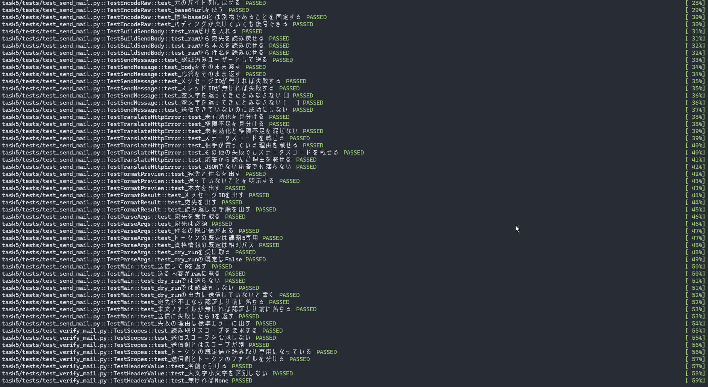
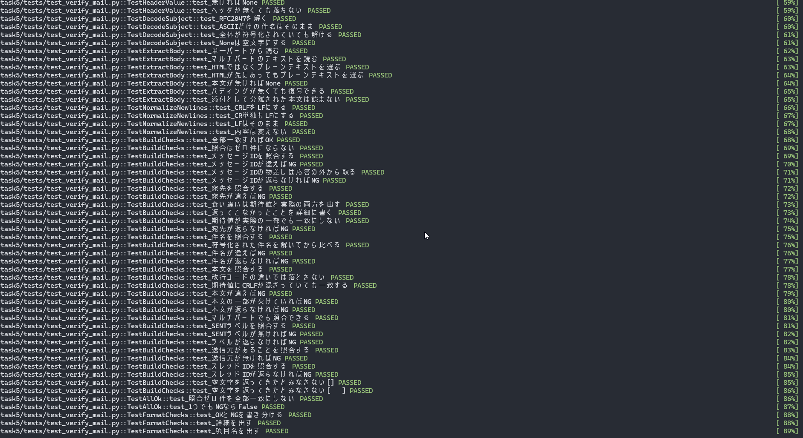
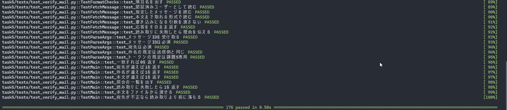

本物の Gmail には繋がない。`task5/verify_mail.py` のテストでは、
**`body` を渡していないこと**を確かめている。確認のつもりの実行が状態を
変えてしまうと、やり直しがきかなくなるため。

いちばん大事なテストは「`--dry-run` では送らない」と「`--dry-run` では
**認証もしない**」の2つ。service を作った回数を数える偽のファクトリを渡して、
**0回であること**を見ている。

## テストで閉じない穴は、実物を1回読んで閉じる

偽の service で固定できるのは**呼び方まで**。次の4つは、176件が全部通っても
分からない。

1. `gmail.send` だけで本当に送れるか
2. 日本語の件名が壊れずに載るか
3. 本文の行末が本当に CRLF になっているか
4. 送信済みラベルが本当に `SENT` で付くか

`task5/verify_mail.py` が読むだけで何も変更しない形でここを閉じる。
4つとも実測で確認できた。

## わざと壊して確かめた（**121か所**・素通りゼロ）

書いた直後にやった。`send_mail.py` を書き終えた時点で1回、`verify_mail.py` を
書き終えた時点でもう1回。

```bash
.venv\Scripts\python.exe task5\tools\mutate.py
```

通っているテストの数は、守られている範囲を意味しない。落ちなかった行が
「テストが見ていない場所」なので、そこだけ手当てする。

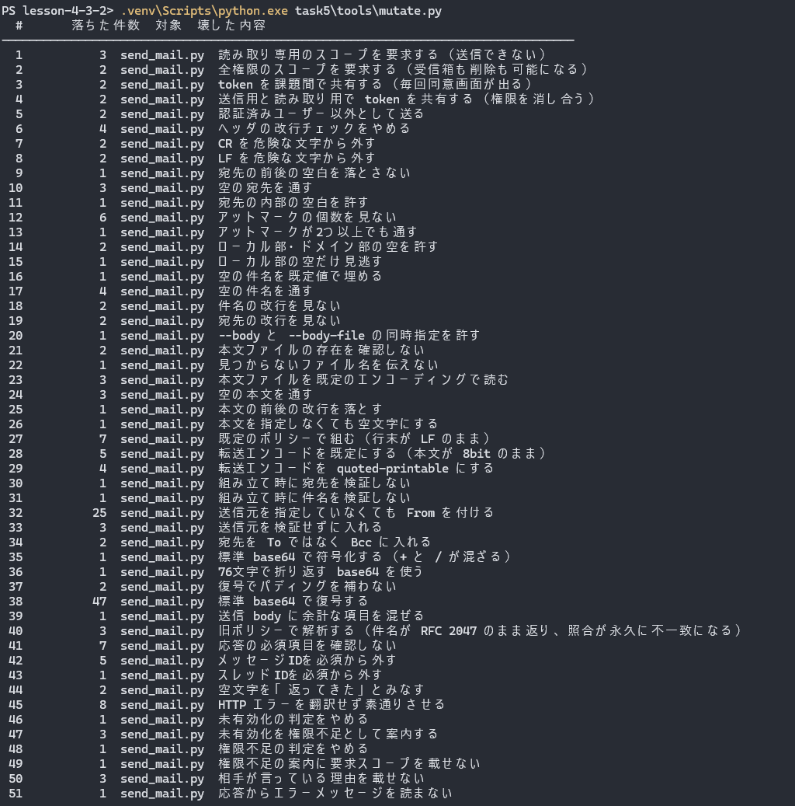
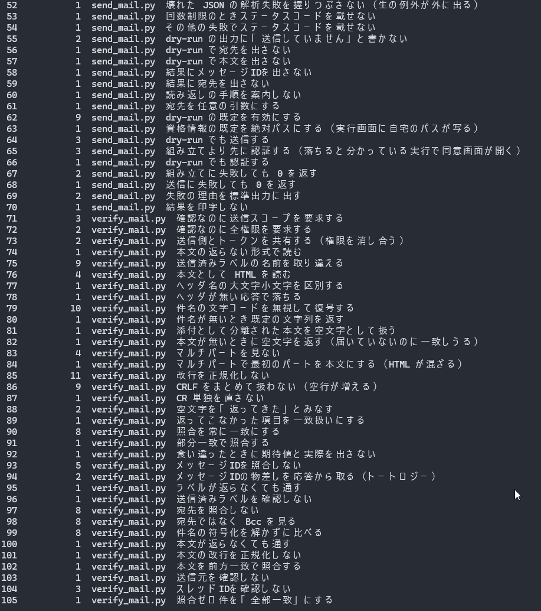
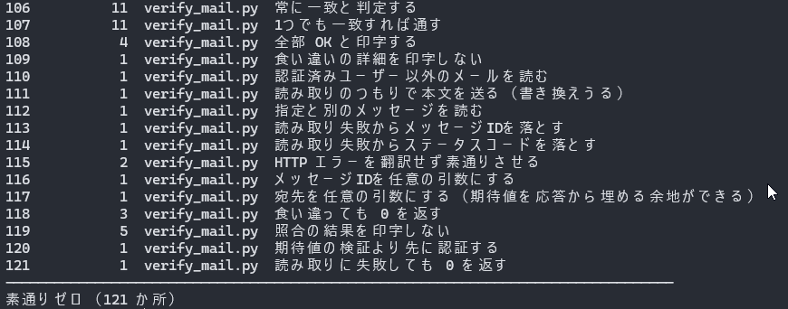

### 素通りしたもの（送信側 7件）

| 素通りしたもの | 何が起きていたか |
|---|---|
| 空の宛先を通す | 空文字は**形式チェックにも引っ掛かる**ので、空の判定を外しても別の理由で落ちていた。エラーの文言まで見るようにした |
| 宛先の改行を見ない | 改行は**空白でもある**ので、空白チェックが拾っていた。同上 |
| 送信元を検証せずに入れる | `--from` に相当するケースのテストが無かった |
| 応答からエラーメッセージを読まない | 読めなくても `str(error)` に同じ文が入るので通っていた。内部表現が画面に出ないことを見るようにした |
| 壊れた JSON の解析失敗を握りつぶさない | 500 番台で HTML が返るケースのテストが無かった |
| その他の失敗でステータスコードを載せない | 429 だけ専用の分岐があり、そこしか見ていなかった |
| 結果にメッセージ ID を出さない | **読み返しコマンドの中にも同じ ID が入っている**ので、専用の行を消しても通っていた |

上から2つが同じ形で、**「例外が出ること」と「正しい理由で落ちること」は別物**という話だった。
下から1つは課題4でも同じ形の素通りが出ている（参加リンクの中に会議 ID が入っていた）。

### 素通りしたもの（読み返し側 5件）

| 素通りしたもの | 何が起きていたか |
|---|---|
| マルチパートで最初のパートを本文にする | 偽の応答で **text/plain を先に置いていた**ので、順序を見ない実装でも通っていた。HTML を先に置いた応答を足した |
| 返ってこなかった項目を一致扱いにする | `str(None)` と比べても不一致にはなるので、判定は変わらなかった。**画面に出る理由**が変わるので、そちらを見るようにした |
| 食い違ったときに期待値と実際を出さない | 詳細の中身を見るテストが無かった |
| 件名が返らなくても通す | **実装側が冗長だった。** 欠落の判定は共通の比較関数が既にやっており、手前の分岐は消しても誰も落ちない。テストではなく実装を削った |
| 本文の改行を正規化しない | 期待値が LF だけだったので、期待値側の正規化が効いていなかった。CRLF を含む期待値のテストを足した |

11件のうち**10件はテストを締めて消し、1件は実装を削った**。

### 「置換できなかった」も素通りとして数える

実装を直したあと、`mutate.py` の壊しかたが古い文字列を指したままになっていた。
道具はこれを**素通りと同じ扱いで報告する**。

```
99  置換不能  verify_mail.py  件名の符号化を解かずに比べる（一致 0 件）
```

黙って飛ばすと「壊せなかった」が「壊しても落ちなかった」と区別できず、
**何も壊していないのに全部通った**という報告になる。

## つまずいたところ

### 設計の途中で、トークンの共有が破綻していると気づいた

コードを書き始める前は、課題5でトークンを1本にするつもりだった。
`common/google_auth.py` の「権限が足りないトークンは捨てて取り直す」という
仕様と、send / verify でスコープが違うことを並べた時点で、**実行のたびに
同意画面が出る**形になると分かった。

実際に踏む前に気づけたのは、**先に公式のスコープ一覧を読んで
「`gmail.send` では読み返せない」を確定させていた**から。
コードを書きながら気づいていたら、2本目のトークンを足す改修になっていた。

### テストの期待値が、自分の書いたテストのバグを2つ捕まえた

**1つめ。** 本文の照合テストで、`--body` を渡し忘れていた。既定の本文が
期待値になり、偽の応答と食い違う。**宛先の違いを見たかったテストが、
本文の違いで落ちていた。** 通ってはいたが、正しい理由で通っていなかった。
落ちた項目が1件だけであることまで見るように直した。

**2つめ。** 最初に書いた本文のテストが `.rstrip("\n") == BODY` になっていた。
これだと**行末が CRLF になっていても通る**。期待値を仕様（RFC 2822 は
行末を CRLF と定める）から書き直して、`BODY_ON_WIRE` を明示した。

### コードでは対策していたことを、文章側でやらかした

`--credentials` の既定を相対パスにしてあるのは「公開する実行画面に自宅のパスを
写さない」ためで、課題1から一貫してやっている。**ところが README に書いた
実行例のほうに、`cd ~/Documents/...` 付きのコマンドを貼っていた。**

実行例はそのままスクリーンショットに撮るので、**コマンドに混ざれば画像にも残る。**
コードには歯止めがあったのに、文章には無かった。

見つけたので検査に足した（下記）。ついでに、その検査自体にもバグがあった。
利用者名を `USERNAME` 環境変数から読んでいたが、**実測すると値が違った。**

```
USERNAME env : 'rin'   ← 3文字。先頭が欠けている
Path.home()  : ****    ← 5文字。こちらが実物
```

3文字に切れた名前で部分一致を掛けると、`string` や `printing` に誤爆する。
**実在するパス（ホームディレクトリ名）のほうが権威がある**ので、そちらから取る形に
直した。検査を足しただけでは機能している証拠にならないので、
**わざと危ない文字列を食わせて落ちることを確かめてある**。

### 自分のメールアドレスを12か所に埋め込んでいた

上のパスの件を直した直後、同じ質問がもう一段深いところに刺さった——
**「README のメールアドレスは？」**

課題1〜4のテストは、宛先に `nana@example.com` を使っていた。**課題5だけ、
実在する自分のアドレスをそのまま書いていた**（README に6か所、テストと
ミューテーションに6か所）。既にある約束を、自分で破っていたことになる。

| | 課題1〜4 | 課題5（直す前） |
|---|---|---|
| テストの宛先 | `nana@example.com` | 実在するアドレス |
| README の実行例 | — | 実在するアドレス |

コード側は `example.com`（RFC 2606 の予約ドメイン。実在しない）に置き換え、
README は `<自分のメールアドレス>` に伏せた。**まだ commit していなかったので、
履歴には残らずに済んだ。**

この2つ（パスとアドレス）は同じ形をしている。**「公開してはいけないもの」を
コードでは弾いていたのに、文章では弾いていなかった。** どちらも検査に足した。

## 文章もコードと突き合わせた

README に書いた数字や名前は、書いた時点では正しくても、あとから増減する。

```bash
.venv\Scripts\python.exe task5\tools\check_docs.py
```

| 検査 | 見ているもの |
|---|---|
| メッセージ ID が1種類だけ | 実行画面と照合画面が**別のメールを指したまま**並んでいないか |
| スコープ名がコードと一致 | 採った2つと、採らなかった候補が取り違えられていないか |
| 要求しているスコープが文章に出ている | 余計なものが無いだけでなく、**書き落としも**見る |
| トークンのファイル名がコードと一致 | 途中で2本に分けたので、片方だけ古い名前で残っていないか |
| 「〜件」の数字が実測と一致 | pytest に数えさせた値と突き合わせる |
| 自宅のパスや利用者名が写っていない | **実行例はスクリーンショットにも残る**。コマンドにパスが混ざっていないか |
| 実在しうるメールアドレスが無い | RFC 2606 が予約している `example.com` 以外のアドレスが書かれていないか |
| 貼った画像と撮った画像が一致 | **出力が何枚に分かれるかは撮るまで分からない**。参照と実物が両方向で揃っているか |
| ソースにも実名・パス・実アドレスが無い | README だけ見ていると、**検査を書いたファイル自身**が漏らす |
| 参照しているファイルが実在する | 名前を変えたときに文章が置き去りになっていないか |

3・4・6〜9行目は課題5で足した検査。3と4は**この課題で実際に動かした部分**で、
文章が置き去りになりやすいと分かっていたところ。6〜9は下記のとおり、全部実際にやらかした。

### この検査で捕まえられないもの

**画像の中身は誰も見ていない。** 枚数と実在しか確かめていないので、
写っている値・アドレス・実名は人が目で見るしかない。道具の出力にもそう書いてある。

```
（画像は枚数と実在しか見ていない。写っている値・アドレス・実名は目視で確認すること）
```

これは飾りではなく、**実際にここで事故った**。文章側は「メッセージ ID が1種類だけ」を
通っていたのに、**実行画面のスクリーンショットと照合画面のスクリーンショットが
別のメールを指していた**（送信をやり直した結果、片方だけ ID が変わっていた）。

課題4で `check_docs.py` を作ったきっかけが、まさに「実行画面と照合画面が別のものを
指したまま並びかけた」ことだった。**同じ失敗が、検査の届かない画像の側で再発した。**

送信はやり直すと ID が変わるので撮り直せないが、読み返しは何度でもやり直せる。
**照合の画像のほうを撮り直して揃えた**——「送信は取り消せない／読み取りは何度でも」
という設計上の非対称が、そのまま撮影の手順にも出てきた。

## 後始末

送ったメールは**自分から自分への1通**で、実害が出ない宛先を選んである。
削除には別のスコープ（`https://mail.google.com/`）が要るので、**このリポジトリでは
実装していない**（採点が済むまでメールを残すため、という理由もある）。
