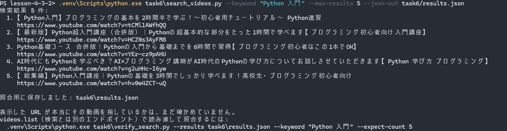
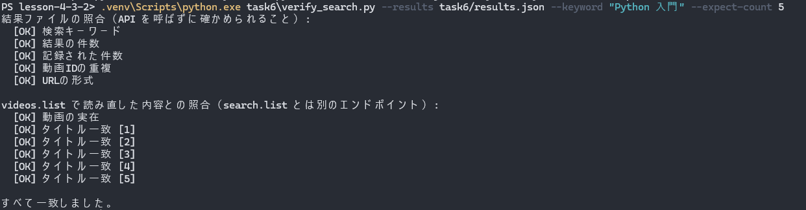
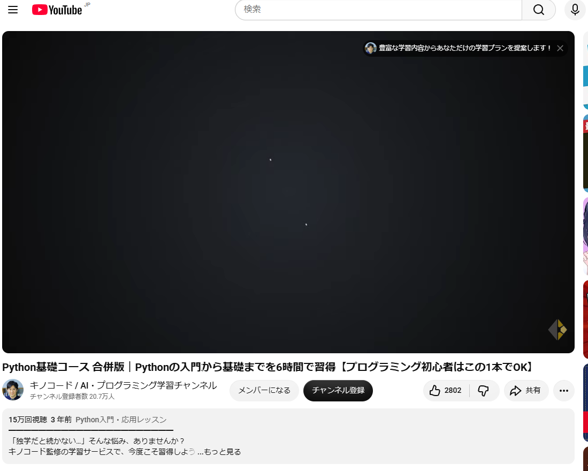
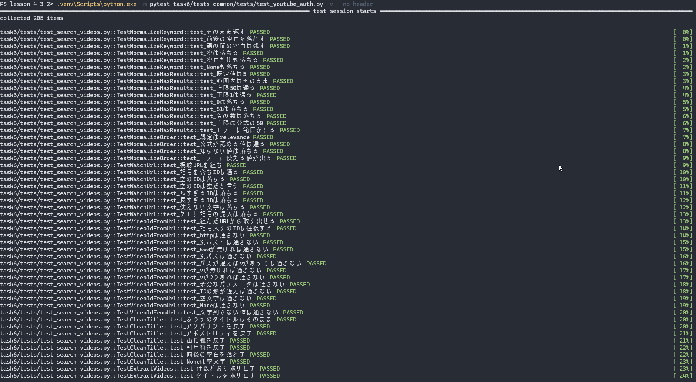
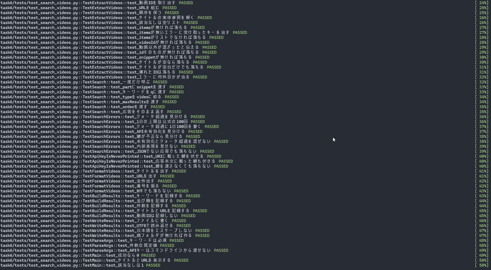
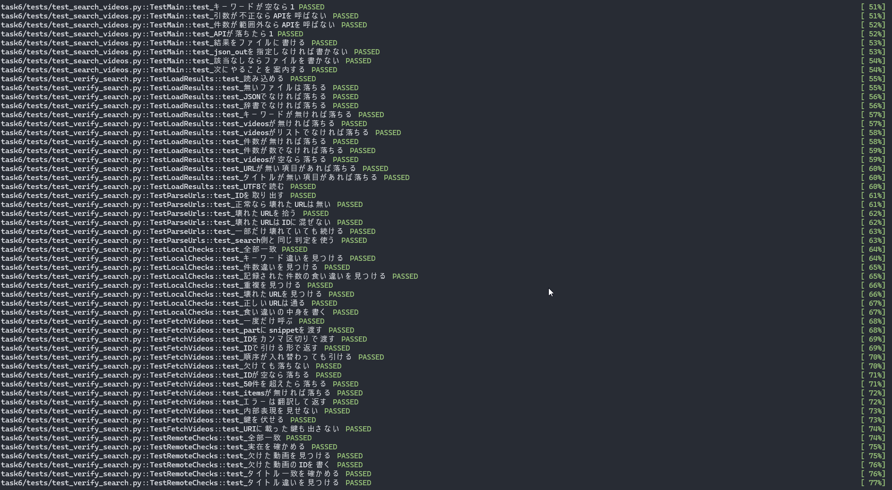
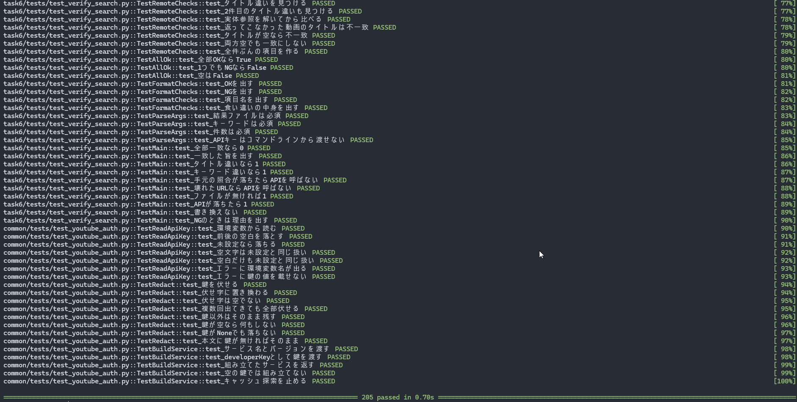
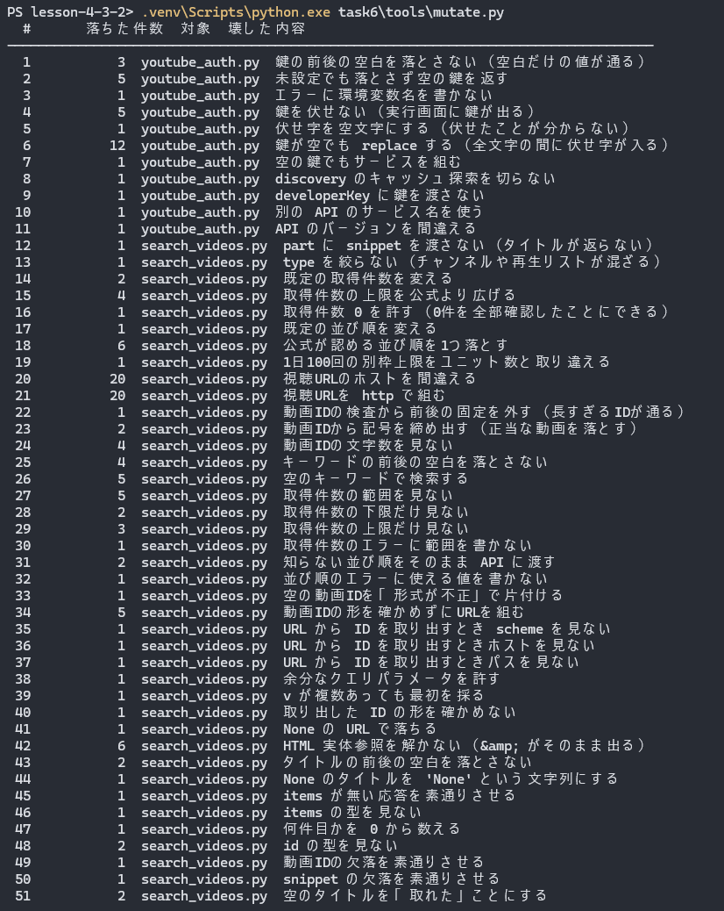
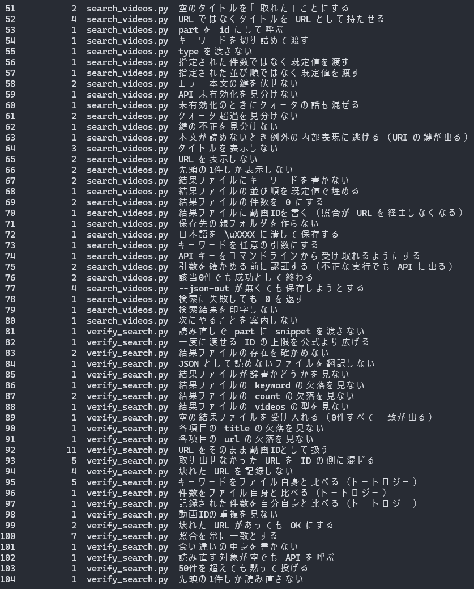
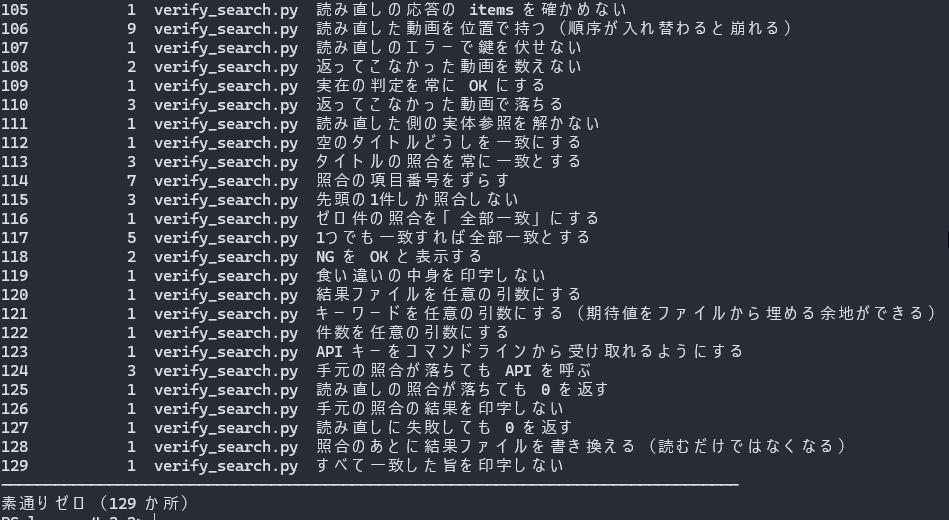

# 課題6: YouTube API

> YouTube Data API を利用して、特定のキーワードに基づく動画検索を行うスクリプトを作成してください。
> 検索結果から動画のタイトルと URL を抽出し、コンソールに表示する。
>
> 【ヒント】：YouTube Data API を利用

| | |
|---|---|
| 検索して表示する | [`task6/search_videos.py`](search_videos.py) |
| 読み直して照合する | [`task6/verify_search.py`](verify_search.py) |
| 認証（API キー） | [`common/youtube_auth.py`](../common/youtube_auth.py) |

## この課題だけ、前提がひとつ違う

課題1〜5は、**こちらが作った物**が相手側に残った。ドライブのファイル、ドキュメント、
Meet のスペース、Zoom の会議、送信済みメール。だから「実物を1回読み返して閉じる」が
そのまま使えた。作った物の ID を持っていて、それを鍵に読み返せばよかった。

**検索は何も作らない。** 読むだけなので、読み返す対象が存在しない。

代わりに出てくるのが**トートロジー**である。読み取り中心の API は、確認が
「取ってきた値どうしを比べる」形になりやすい。たとえば `search.list` の応答から
`videoId` と `title` を取り出して、同じ応答の `videoId` と `title` に一致するかを
確かめても、それは1回の応答が自分自身と一致していると言っているだけで、
何も確かめていない。

課題4で `join_url` が正しいかを応答の `id` と比べかけたのと同じ形である。
そのときの結論は「**照合の物差しは、応答の外から取る**」だった。
この課題では、それを3か所すべてで守る必要がある。

## 先に調べたこと（コードを書く前に）

### 使う API は2つ

| エンドポイント | 何をするか | どこで使うか |
|---|---|---|
| `search.list` | キーワードで検索する | `search_videos.py` |
| `videos.list` | 動画 ID から動画を引く | `verify_search.py` |

`search.list` は `part=snippet` で `items[].id.videoId` と `items[].snippet.title` を返す。
`type` を指定しないと既定が `video,channel,playlist` なので、チャンネルや再生リストが
混ざる。それらは `videoId` を持たないため、`type=video` で絞る。

### クォータは「ユニット」だけではなかった

公式のクォータ表にこう書いてある。

> Projects that enable the YouTube Data API have a default quota allocation of
> 100 `search.list` calls, 100 `videos.insert` calls, and 10,000 units per day
> combined for all other endpoints.

つまり **`search.list` だけ「1日 100 回」という別枠の上限**を持っていて、
10,000 ユニットの枠とは別に数えられる。「軽い呼び方に変えてユニットを節約する」では
回避できない。一方 `videos.list` は 10,000 ユニット枠の 1 ユニットで、しかも
ID を50件までまとめて1回で引ける。

これは設計にそのまま効いた。**確認は安い側でやる。**
検索は1回で済ませ、照合は `videos.list` に寄せる。

同時に「テストは絶対にネットワークに出さない」も、こだわりではなく必要になった。
テストを1回走らせるたびに検索を1回使っていたら、1日100回で足りるはずがない。
このリポジトリのテストはすべて偽の service を渡す形で書いてある。

### 認証は API キー。OAuth ではない

検索対象は公開データで、誰かの持ち物ではない。だから「本人が許可する」という段が
そもそも無い。公式も、OAuth が要るのは「ユーザーの認可が必要なメソッド」だと書いている。

| | どういう相手か | 手順 |
|---|---|---|
| `common/google_auth.py` | **本人のデータ**（Drive・Docs・Gmail） | 同意画面 → `token.json` → リフレッシュ |
| `common/zoom_auth.py` | アカウントの権限で動く | 同意画面なし・毎回取り直し |
| `common/youtube_auth.py` | **公開データを読むだけ** | 鍵を1本渡すだけ |

副産物として、課題1〜5で毎回困っていた
「テスト段階の同意画面はリフレッシュトークンが7日で失効する」問題からも外れた。

### API キーは URL のクエリに載る（実測）

**ここが課題1〜5の資格情報といちばん違う。** OAuth のトークンは HTTP ヘッダに載るが、
API キーは URL のクエリ文字列に入る。そして google-api-python-client は、
失敗したリクエストの URI を `HttpError` に持たせる。

手元で確かめた（通信していない。リクエストを組んだだけで `execute()` していない）。

```
[1] エンドポイント: https://youtube.googleapis.com/youtube/v3/search
    クエリのキー  : ['alt', 'key', 'maxResults', 'part', 'q', 'type']
    鍵が URI に載る: True

[2] str(HttpError) の全文:
    <HttpError 403 when requesting https://youtube.googleapis.com/youtube/v3/search?part=snippet&q=...&key=AIzaZZZ…（39文字が省略なしで出る）&alt=json returned "quota". Details: "quota">
    鍵が出るか: True

[3] redact 後:
    <HttpError 403 when requesting ...&key=***&alt=json returned "quota". Details: "quota">
    鍵が残るか: False
```

つまり **例外をそのまま `print` した時点で鍵が公開される**。実行画面は
スクリーンショットにして public リポジトリへ置くので、これは事故になる。

対策は2つ入れた。

1. エラーの文面は必ず `youtube_auth.redact()` を通す
2. `str(error)` に逃げない。応答 JSON の `message` だけを見せる。
   本文が読めないときも `(応答の本文を読み取れませんでした)` で止める

課題5で `--to` を必須にしたのと同じで、**危ない経路を「気をつける」ではなく
「通れない」形にする**。

### 鍵はコマンドライン引数にしない

`--api-key` は**わざと用意していない**。コマンドラインに書いた値はシェルの履歴に残り、
実行画面のスクリーンショットにも写る。環境変数からしか受け取らない。

「うっかり `--api-key` を足す」を防ぐために、`--api-key` を渡したら
落ちることをテストで固定してある。

### タイトルは HTML 実体参照で返る（実測）

課題5では「日本語の件名は RFC 2047 で符号化されて返る」という罠があった。
同じ形のものが無いかを疑って `html.unescape()` を通す実装にしたが、
**書いた時点では確かめていなかった**。公式の `search.list` のリファレンスに
実体参照の記述は無く、提出用に検索した「Python 入門」の5件にも `&` を含む
タイトルが1つも無かったので、解いても解かなくても同じ結果になる実行しか
していなかったのである。

そこで `&` が出やすいキーワードで1回だけ引いて確かめた。

```
キーワード: 'rock & roll history' / 取得 25 件

[実体参照あり] 9.
    生      : History of Rock &amp; Roll - The 1950s
    unescape: History of Rock & Roll - The 1950s
[実体参照あり] 18.
    生      : How Teenagers Ran the Rock &#39;n&#39; Roll Era
    unescape: How Teenagers Ran the Rock 'n' Roll Era
（他9件）

生の文字列に '&' を含むもの : 11 件
unescape で変化したもの     : 11 件
```

**25件中11件が実体参照を含んでいた。** `&amp;`（アンパサンド）と
`&#39;`（アポストロフィ）の両方が出た。しかも `&` を含むタイトル11件が
そのまま11件とも実体参照で、**生の `&` は1件も返ってこなかった**。

解かずに表示すると、画面には `History of Rock &amp; Roll` と出る。
課題は「タイトルを抽出してコンソールに表示する」なので、これは要件を満たしていない。

いちばん効いたのは、**日本語のキーワードでは1件も再現しなかった**ことである。
提出用の「Python 入門」だけで試していたら、この API の性質に永久に気づけなかった。
テストデータが1種類だと、たまたま一致している値を検出できない——
4-2-2 で2回踏んだのと同じ形が、外部 API の応答でも出た。

照合するときは `search.list` 側と `videos.list` 側の**両方**に同じ処理を掛ける。
片側だけだと、同じ動画なのに永久に一致しない。

## 照合の物差しをどこから取るか（この課題の山場）

物差しを3つとも、応答の外から取った。

| 何を確かめるか | 物差しの出どころ |
|---|---|
| どの検索の結果か・何件あるか | **人間がコマンドラインで渡す**（`--keyword` / `--expect-count`） |
| 動画 ID | **表示した URL から取り出す** |
| タイトル | **`videos.list`**（`search.list` とは別のエンドポイント） |

2つめが効いている。`search_videos.py` が書く結果ファイルには、
**動画 ID をわざと入れていない**。

```json
{
  "keyword": "...",
  "order": "relevance",
  "count": 5,
  "videos": [{"title": "...", "url": "https://www.youtube.com/watch?v=..."}]
}
```

ID を書いておくと、`verify_search.py` はそれを読んで済ませてしまい、
**URL の組み立てが正しいかを一度も確かめないまま「一致した」が出る**。
URL から取り出させると、組み立てが間違っていればそこで初めて露見する。

取り出しは `search_videos.video_id_from_url()` を共用する。別実装にすると、
組み立てと取り出しが両方同じように間違っていても往復して通ってしまう。

### `videos.list` の罠

**存在しない ID を渡してもエラーにならない。** その分が `items` から黙って抜けて
200 で返る。件数を見ないと「返ってこなかった」が「一致した」に化ける。

課題1から繰り返し出ている「**照合で『返ってこなかった』を『一致した』にしない**」が、
この API では既定の挙動として現れる。

もうひとつ、`videos.list` は**渡した順で返すと保証していない**。
位置で取ると静かに入れ替わるので、ID で引ける形に直してから照合する。

## 照合する項目（実物を見る前に決めた）

手元だけで確かめられることと、API を呼ばないと確かめられないことに分けた。
**手元の照合が落ちる実行は、ネットワークに出さない**（`search.list` は1日100回しか無い）。

**API を呼ばずに確かめること**

| 項目 | 何を見るか |
|---|---|
| 検索キーワード | 結果ファイルの記録 ↔ `--keyword`。昨日のファイルを渡したまま気づかない、を防ぐ |
| 結果の件数 | 実際の件数 ↔ `--expect-count` |
| 記録された件数 | ファイル自身が申告する件数 ↔ 実際の件数。手で削ると食い違う |
| 動画IDの重複 | 同じ動画が二重に並んでいないか |
| URLの形式 | 全部の URL から11文字の ID を取り出せるか |

**`videos.list` で読み直して確かめること**

| 項目 | 何を見るか |
|---|---|
| 動画の実在 | 渡した ID が**全部**返ってきたか（黙って抜けるので件数を見る） |
| タイトル一致 [N] | 表示したタイトル ↔ `videos.list` のタイトル。1件ずつ |

## セットアップ（Google 側の手作業）

課題1〜5と同じく、コンソールの操作は本人しかできない。

1. [Google Cloud コンソール](https://console.cloud.google.com/) で、課題1で作った
   プロジェクトを選ぶ
2. 「APIとサービス」→「ライブラリ」→ **YouTube Data API v3** を有効にする
   - **API ごとに有効化が別**。Drive・Docs・Meet・Gmail を有効にしてあっても
     YouTube は無効のまま。反映に数分かかることがある
3. 「APIとサービス」→「認証情報」→「＋認証情報を作成」→ **API キー**
4. 作ったキーの「キーを制限」→ **APIの制限＝YouTube Data API v3 のみ**
5. 環境変数に入れる。**ファイルには書かない**

```powershell
$env:YOUTUBE_API_KEY = "<作成したAPIキー>"
```

課題4（Zoom）と同じ方針で、**リポジトリに置き場所を作らない**のがいちばん漏れにくい。

## 実行方法

コマンドは**すべてリポジトリのルートで**、`.venv\Scripts\python.exe` を直接呼ぶ。

### 1. 検索してタイトルと URL を表示する

```bash
.venv\Scripts\python.exe task6\search_videos.py --keyword "Python 入門" --max-results 5 --json-out task6/results.json
```

```
検索結果 5 件:
  1. 【Python入門】プログラミングの基本を2時間半で学ぶ！〜初心者用チュートリアル〜 Python速習
     https://www.youtube.com/watch?v=tCMl1AWfhQQ
  2. 【最新版】Python超入門講座（合併版）｜Pythonの超基本的な部分をたった1時間で学べます【プログラミング初心者向け入門講座】
     https://www.youtube.com/watch?v=HCZNs3AyFM8
  3. Python基礎コース 合併版｜Pythonの入門から基礎までを6時間で習得【プログラミング初心者はこの1本でOK】
     https://www.youtube.com/watch?v=YEr-cz9pAHU
  4. AI時代にもPythonを学ぶべき？AI×プログラミング講師がAI時代のPythonの学び方についてお話しさせていただきます【Python 学び方 プログラミング】
     https://www.youtube.com/watch?v=g2uHHc-I6yw
  5. 【総集編】Python入門講座｜Pythonの基礎を3時間でしっかり学べます！高校生・プログラミング初心者向け
     https://www.youtube.com/watch?v=hv0w4ZCT-uQ

照合用に保存しました: task6\results.json

表示した URL が本当にその動画を指しているかは、まだ確かめていません。
videos.list（検索とは別のエンドポイント）で読み直して照合するには:
  .venv\Scripts\python.exe task6\verify_search.py --results task6/results.json --keyword "Python 入門" --expect-count 5
```



**成功したときも「まだ確かめていない」と書く。** 5件のタイトルと URL が並んだ画面は
いかにも成功に見えるが、この時点で分かっているのは「API が応答を返した」までである。

### 2. 読み直して照合する

```bash
.venv\Scripts\python.exe task6\verify_search.py --results task6/results.json --keyword "Python 入門" --expect-count 5
```

```
結果ファイルの照合（API を呼ばずに確かめられること）:
  [OK] 検索キーワード
  [OK] 結果の件数
  [OK] 記録された件数
  [OK] 動画IDの重複
  [OK] URLの形式

videos.list で読み直した内容との照合（search.list とは別のエンドポイント）:
  [OK] 動画の実在
  [OK] タイトル一致 [1]
  [OK] タイトル一致 [2]
  [OK] タイトル一致 [3]
  [OK] タイトル一致 [4]
  [OK] タイトル一致 [5]

すべて一致しました。
```



上の5項目は API を呼ばずに確かめている。下の6項目で初めて外に出る。
使ったユニットは `videos.list` の 1 ユニットだけで、5件を1回でまとめて引いている。

### 3. 表示した URL を実際に開く

照合が通っても、機械が見ているのは文字列の一致である。3件目の URL を開くと、
`videos.list` が返したタイトルと同じ動画が出る。



### オプション

| 引数 | 既定 | 説明 |
|---|---|---|
| `--keyword` | （必須） | 検索キーワード |
| `--max-results` | 5 | 取得件数。1〜50 |
| `--order` | `relevance` | 並び順。`date` / `rating` / `relevance` / `title` / `videoCount` / `viewCount` |
| `--json-out` | なし | 照合用に結果を保存するパス |

公式は `maxResults` に 0 を認めているが、**このスクリプトは 1 以上しか受け取らない**。
0 件の結果に「全部一致」を出すと、何も確かめていない実行が成功に化けるため。

同じ理由で、検索の該当が 0 件だったときは終了コード 1 で終わり、結果ファイルも書かない。
「対象が尽きた」を成功で終わらせない（動画要約の自動実行で踏んだのと同じ形）。

## テスト

**205件**（`search_videos` / `verify_search` / `youtube_auth`）。
リポジトリ全体では 861 件。

```bash
.venv\Scripts\python.exe -m pytest task6/tests common/tests/test_youtube_auth.py -v --no-header
```






テストは実装より先に書いた。`ModuleNotFoundError` で落ちることを確認してから
実装に入っている。先に書かないと、期待値を実装から作ってしまう。

外部サービスに繋ぐ部分はすべて偽の service を渡している。
**1日100回しか検索できない**ので、これは選択ではなく前提である。

## テストで閉じない穴は、別のエンドポイントで閉じる

偽物で確かめられるのは「呼び方」までである。`part` の綴りが違っても、
`type` の絞り込みを間違えていても、偽物は文句を言わずに応答を返す。

課題1〜5はここを「実物を1回読み返す」で閉じた。この課題は作る物が無いので、
**別のエンドポイントで読み直す**ことで閉じている。

`search.list` と `videos.list` が同じタイトルを返したなら、
表示した URL は確かにその動画を指している。

## わざと壊して確かめた（**129か所**・素通りゼロ）

```bash
.venv\Scripts\python.exe task6\tools\mutate.py
```

[`task6/tools/mutate.py`](tools/mutate.py) が実装を1か所ずつ書き換えてテストを走らせ、
落ちなければ「素通り」として報告する。通っているテストの数は、
守られている範囲を意味しない。

対象は `search_videos.py` / `verify_search.py` に加えて
**`common/youtube_auth.py` も含む**。共有モジュールは、壊れると落ちるのが
「使っている側」なので、使う側のテストだけ回していると原因が遠くなる（課題3の教訓）。





### 素通りしたもの（9件）

最初の実行で9件が素通りした。内訳が、この課題のテーマをそのままなぞっていた。

**テスト側がトートロジーだったもの（3件）**

```python
assert calls[0][0] == youtube_auth.API_SERVICE_NAME   # 定数を定数自身と比べている
```

`API_SERVICE_NAME` を `"youtubeAnalytics"` に書き換えても、両辺が一緒に変わるので
必ず通る。同じ形が `API_VERSION` と `DAILY_SEARCH_CALL_LIMIT` にもあった。
リテラルで書き直したら3件とも落ちるようになった。

**応答の外から物差しを取れと書いておきながら、テストでそれをやっていた。**

**片方の検査が先に効いていて、目的の検査が確かめられていなかったもの（3件）**

- `https://youtu.be/<ID>` はパスが `/watch` でないので、**ホストを見なくても弾ける**。
  ホストの検査が効いているかは、`https://youtube.com/watch?v=<ID>`（www なし）でしか分からない
- 同じ理由で、パスの検査は `https://www.youtube.com/other?v=<ID>` でしか確かめられない
- `None` と `""` は `urlparse` に渡しても例外にならず空の結果になるだけなので、
  型の検査を外しても素通りする。効きめは**真値の非文字列**（`urlparse(12345)`）でしか出ない

3件とも「テストは通っていたが、通っていた理由が思っていたのと違った」形である。

**壊しかたの側が悪かったもの（3件）**

- 置換の一致が2件で、そもそも書き換えられていなかった（`ok = expected == actual` が
  インデント違いで2か所に部分一致していた）
- エラー文の1行だけ差し替えても、別の行に同じ環境変数名が残っていた

「置換できなかったミューテーション」を素通りと同じ扱いにしていたので目に入った。
成功として数えていたら、**何も壊さずに「素通りゼロ」**と出ていた。

## つまずいたところ

### テストヘルパーが「0件」を作れなかった

該当0件のときの扱いを3件テストしたら、全部落ちた。原因はヘルパーだった。

```python
def search_response(*items):
    records = list(items) if items else [item(), item(...)]   # 引数ゼロ＝既定の2件
```

`search_response(*[])` は引数ゼロなので、既定の2件に戻る。
**「0件のとき」を確かめたつもりで、2件の応答を相手にしていた。**
`empty_response()` を別に用意して直した。

検証側の期待値のほうが間違っていた、はこれで9回目になる（4-2-2 で3回、
4-3-2 課題1で5回）。**NG が出たらまず実数を数え直す**。

### テスト用のダミー鍵が、本物の形をしていた

リポジトリ全体を「API キーらしき文字列」で検査すると決めた時点で、
テストに置いていた `AIzaSy...` 形式のダミーが引っかかることに気づいた。

除外リストに入れるのは筋が悪い。**本物を入れてしまったときも同じ言い訳で通る**からである。
ダミーのほうを `DUMMY-KEY-FOR-TESTS-not-a-real-credential` に変えた。
読んだ人が本物と誤解する危険も消える。

### 使い捨ての確認スクリプトが、本番に入れた安全策を素通りした

実体参照を確かめるために、リポジトリの外に短い確認用スクリプトを書いた。
`service.search().list(...).execute()` を直接呼ぶだけのものである。

それが失敗して、こうなった。

```
googleapiclient.errors.HttpError: <HttpError 400 when requesting
https://youtube.googleapis.com/youtube/v3/search?...&key=<ここに鍵が入る>&alt=json
returned "API key not valid. Please pass a valid API key.".
```

**`search_videos.py` が絶対に出さないようにしてある形が、そのまま出た。**
このときは鍵の代わりにプレースホルダを渡していたので実害は無かったが、
本物を入れていたら、この文字列ごと貼り付けていた。

対策を入れたのは `search_videos.py` と `verify_search.py` で、
確認用のスクリプトはその外にいる。しかも**確認用の使い捨てほど、
素の例外をそのまま画面に出す**。書き直して `search_videos.search()` を
通す形にした（翻訳と伏せ字がそこに入っている）。

課題5で「道具を作ると守られたと感じるが、守られたのは道具が見ている範囲だけ」と
書いた。**範囲の外は、他人のコードではなく自分がその場で書く3行**だった。

### 検査を書いた本人が、最初にその検査へ引っかかった

「API キーらしき文字列がリポジトリのどこにも無いか」を足した直後、
**この README が NG になった**。上に貼った実測ログの偽鍵が、本物と同じ
`AIza` ＋39文字の形をしていたためである。

課題5でも同じことが起きている（利用者名を検出する関数の docstring に、
実際の名前を書いていた）。**道具を作ると「守られた」と感じるが、
守られたのは道具が見ている範囲だけ**で、書き手自身は範囲の外にいない。

課題5では手作業の grep で見つけた。今回は検査のほうが先に見つけた。
リポジトリ全体に広げた効果がここに出た。

### 検査を広げたら、誤検出が4件出た

漏れの検査をリポジトリ全体に広げた初回、4件ヒットして**全部が誤検出**だった。

- 「公開する画面に `C:\Users\...` を写さない」という注意書き（3件）
- ミューテーション用の偽値 `C:/Users/example/`（1件）

本物の利用者名は1件も無かった。ただし**毎回4件鳴る検査は読まれなくなる**ので、
明らかな伏せ字（`...` / `example` / `<...>` / `USERNAME`）が続く場合は見逃すようにした。
危ないのは実在の名前が続くときで、そちらは利用者名の検査が別に見ている。

そのうえで、**検査自体を壊して確かめた**。危ない文字列7種を渡して全部検出できること、
伏せ字6種で1件も鳴らないことを確認している。ファイルには書かず、メモリ上で渡した。
「検査が通った」は「検査が効く」の証拠にならない（課題4の教訓）。

## 文章もコードと突き合わせた

```bash
.venv\Scripts\python.exe task6\tools\check_docs.py
```

[`task6/tools/check_docs.py`](tools/check_docs.py) が13種類を検査する。
目視では出ない種類のズレだけを見る。

| # | 見るもの |
|---|---|
| 1 | 文章の動画 ID が、実際の実行結果（`results.json`）と一致する |
| 2 | 動画 ID の形が11文字である |
| 3 | 視聴 URL の形がコードの定数と一致する |
| 4 | 環境変数名がコードと一致する |
| 5 | 1日の呼び出し上限がコードと一致する |
| 6 | 太字で主張している数が実測と一致する |
| 7 | 肝心の実測値がそもそも書いてある |
| 8 | README に自宅のパスや利用者名が無い |
| 9 | README に実在しうるメールアドレスが無い |
| 10 | 貼った画像と撮った画像が一致する（両方向） |
| 11 | **リポジトリ全体**に実名・パス・実アドレスが無い |
| 12 | **リポジトリ全体**に API キーらしき文字列が無い |
| 13 | 参照しているファイルが実在する |

11 が課題6での格上げである。課題4で作り課題5でソースまで広げたが、
見ていたのは自分の課題フォルダだけだった。同じ漏れが課題1・2・4に残っていても
気づけない状態だったので、`git ls-files` に載るもの全体へ掛けた
（追跡済み＋未追跡で無視されていないもの＝これから公開されるもの）。

1 が課題5の「メッセージIDが1種類だけ」に当たる。検索は実行のたびに結果が変わるので、
撮り直した実行画面と文章がずれても、どちらも「それらしい」ので目では気づけない。
**文章の中の値どうしを比べず、実行の成果物を外から持ってきて突き合わせる。**

### この検査で捕まえられないもの

出力に明記してある。

- 太字でない数字は見ていない
- **画像は枚数と実在しか見ていない。** 写っている値・アドレス・実名・API キーは目視
- キーワードと検索結果の中身が妥当かは見ていない

課題5で、文章側の「メッセージIDが1種類だけ」は通っていたのに、
スクリーンショットが別のメールを指していた。**画像は機械に見えない**ので、
道具に「見ていない」と言わせておく。「すべて一致しました」だけを出す道具は、
検査していない場所まで保証しているように読める。

## 後始末

この課題は**何も作らない**ので、消すものが無い。

課題1のファイル、課題2のドキュメント、課題3のスペース（API から消せない）、
課題4の会議、課題5の送信済みメールと違って、YouTube 側には痕跡が残らない。
読み取り専用の API を選んだ副産物である。

API キーは環境変数にしか置いていないので、ターミナルを閉じれば消える。
恒久的に消したいときは Google Cloud コンソールの「認証情報」から削除する。
